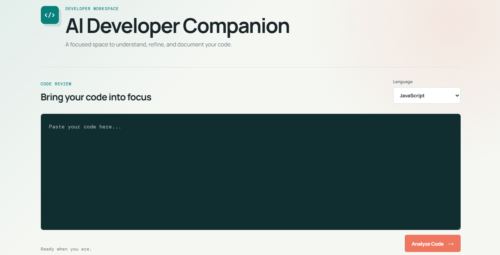

# AI Developer Companion

AI Developer Companion is a small AI-based tool that helps developers understand and review their code. The main idea is to put some common code-review tasks in one place instead of checking everything manually.

## About the Project

In this project, the user can select a programming language and paste their code into the editor. The code is then sent to the backend, where the Gemini API is used to analyze it.

The tool gives the user:

- A simple explanation of what the code does
- Issues or errors found in the code
- Suggestions for improving the code
- Possible test cases
- Basic documentation for the submitted code

It can also detect when the submitted code does not match the selected programming language. For example, if C++ code is submitted while JavaScript is selected, the tool reports the mismatch instead of treating it as normal JavaScript code.

## Features

- Code explanation
- Issue and error detection
- Programming language mismatch detection
- Code improvement suggestions
- Test case generation
- Automatic documentation
- Empty input handling
- Loading state while analysis is running
- Clear error handling when the backend is unavailable
- Simple and responsive interface

## Technologies Used

- HTML
- CSS
- JavaScript
- Node.js
- Express.js
- Google Gemini API

## How It Works

The basic flow of the application is:

1. The user selects a programming language.
2. The user enters their code.
3. The frontend sends the code and selected language to the backend.
4. The backend sends the information to the Gemini API.
5. Gemini analyzes the code.
6. The backend sends the analysis back to the frontend.
7. The results are shown in different sections of the page.

## Project Structure

```text
AI-developer-companion/
│
├── backend/
│   └── server.js
│
├── frontend/
│   ├── index.html
│   ├── script.js
│   └── style.css
│
├── package.json
├── package-lock.json
├── .gitignore
└── README.md
```

## Screenshot

Here is an example of the application:



